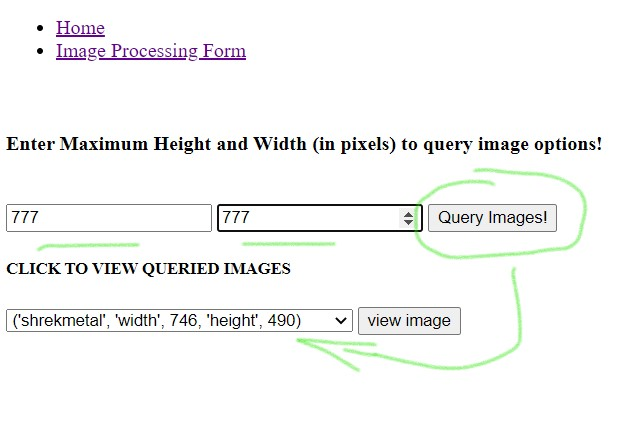
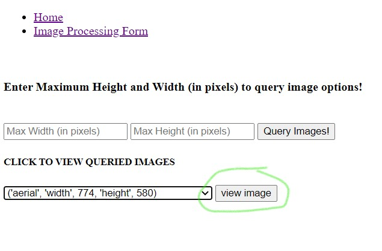
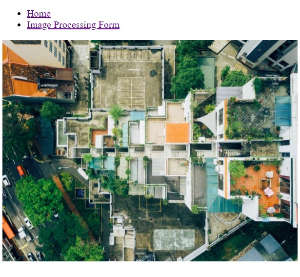
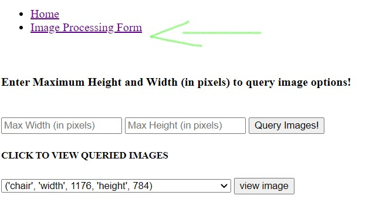
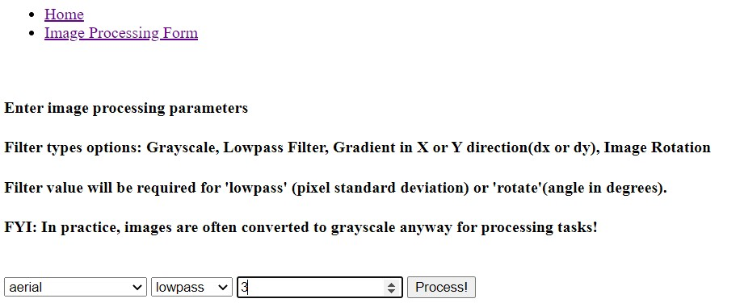
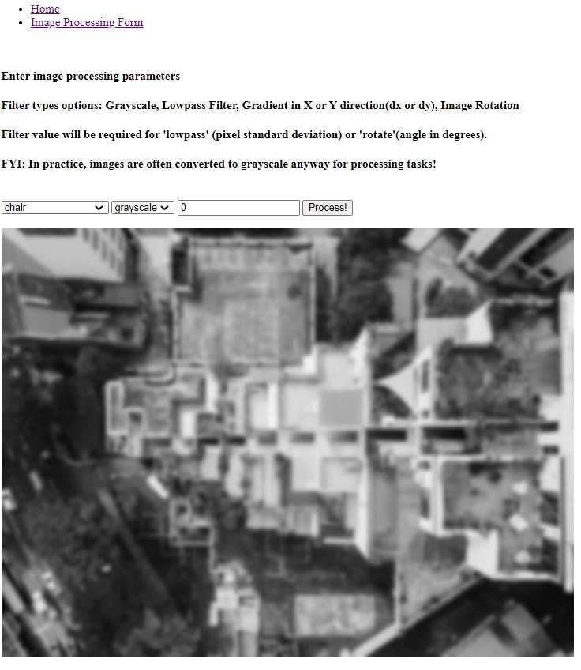

# Image Processing Server
Note: Presently, the application is deployed to google cloud compute engine [LINK](http://35.188.46.22/)

A flask server that can perform image processing tasks or let you browse by pixel dimensions.

## Using locally
The simplest way would to be to have `docker` & `docker-compose` installed and running the following commands

```bash
docker-compose up --build
```

followed by going to the appropriate localhost (default at the moment is port 5000)


## Example usage/steps:

### So the home page lists all the jpg files and you can fill in the query form (by pixel dimensions) to browse what images fit that criteria.


### <u>Enter some pixel values to query images, press **Query Images!**  then select an image from the drop down</u>


### <u>Once you've selected the image, view it!</u>


### <u>Nice!</u>


### <u>Now the fun stuff, image processing!</u>


### <u> Implemented functions: grayscale, lowpass filter, square cropping, dx and dy gradients, and rotation. </u>
### <u>Select an image and filter from the drop down. If applicable enter a filter value</u>


### <u> Example of a low pass filter being applied </u>



## Misc. stuff

Image meta data is stored with MongoDB and the PyMongo API is used to perform queries. Image processing tasks are done via a combination of numpy, scipy, and PIL. 

In theory the image processing should be very easily extensible for being able to add even more image processing tasks!

Here's a cool thing I learned using the following pattern with PIL, Flask, and HTML

```python
# buffer image in bytes and send directly to html
image_PIL= Image.fromarray(image_as_array).convert('RGB')
data = io.BytesIO()
image_PIL.save(data, "JPEG")
encoded_img_data = base64.b64encode(data.getvalue())
return render_template('whatever_template_you_have.html',  img_data=encoded_img_data.decode('utf-8'))
```

So you can buffer your image (and it doesn't have to be from an numpy array, it just has to end up as a PIL Image type) by using BytesIO and base64 encoding to send it directly to your html_template

And your html template can render it like so.

```html

```

I thought this was really cool because my former solution involved first saving the processed image to disk (on the Flask side), then reading it in on the HTML side for rendering. This way I instead keep the image in a memory buffer rather than storage. For this Flask application that is ok because the image files are really small. I can definitely see this being a disaster for larger images.